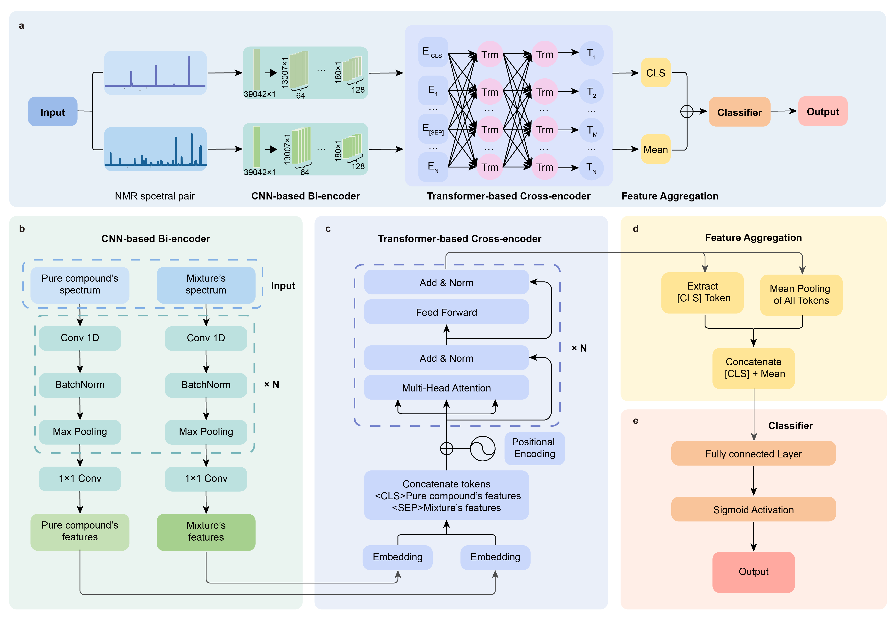

# FlavorFormer

Nuclear Magnetic Resonance (NMR) spectroscopy is a promising method for analyzing mixtures, but identifying components in mixtures using NMR spectra remains challenging. Here, FlavorFormer is proposed by incorporating a hybrid CNN and Transformer architecture to capture both local features and global dependencies from 1H NMR spectra. Furthermore, it leverages a combination of a bi-encoder and cross-encoder, a fusion pooling strategy, and a weighted loss function to identify compounds correctly. FlavorFormer enables the accurate and rapid identification of compounds in flavor mixtures, establishing it as a powerful tool for NMR-based mixture studies. This is the code repo for the paper *FlavorFormer: Hybrid Deep Learning for Identifying Compounds in Flavor Mixtures based on NMR Spectroscopy*.


# Installation

Python 3.13.2 and Pytorch (version 2.7.0+cu118)

Install [Anaconda](https://www.anaconda.com/).

# Clone the repo and run it directly

```shell
git clone https://github.com/yfWang01/FlavorFormer.git
```

Use this command to create python virtual environment.
```shell
cd FlavorFormer
conda env create -f environment.yml
conda activate FlavorFormer
```

# Download the model and run directly


**Training your model and predict mixture spectra data**

Run the file 'demo.ipynb'. The model parameters is located in the [model](model/) folder and the required data is in the [data](data/) folder, FlavorFormer can be reload and predict easily.

